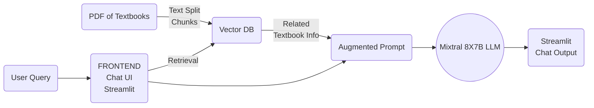

# SchoolToolAI
This is a repo dedicated to creating RAG pipelines to help teachers and students with textbook-related work. Such as explaining textbook information in more or less detail and allowing teachers to create hw assignments and exams.

## Architecture Diagram

Here is how the system is designed:

